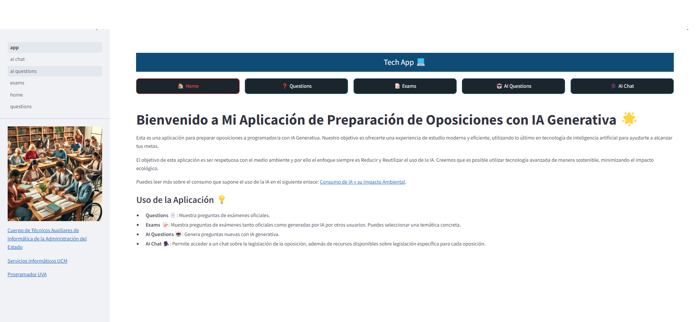
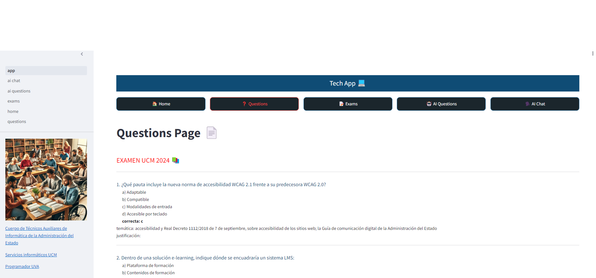
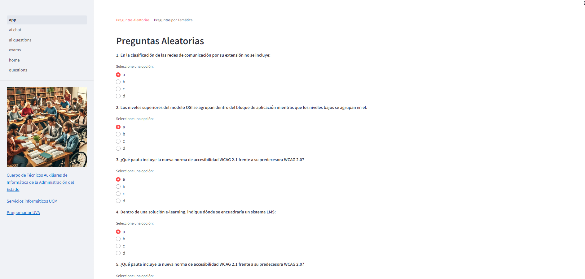
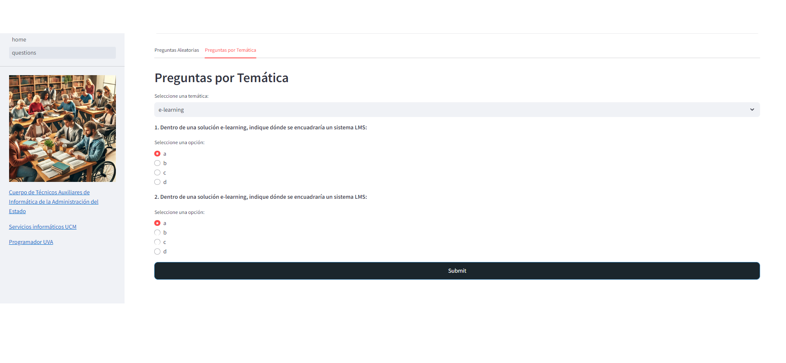
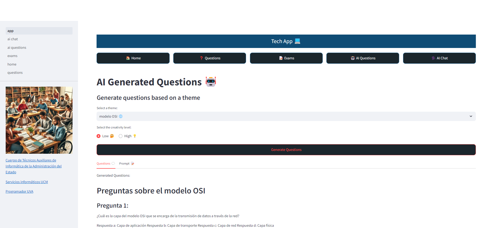
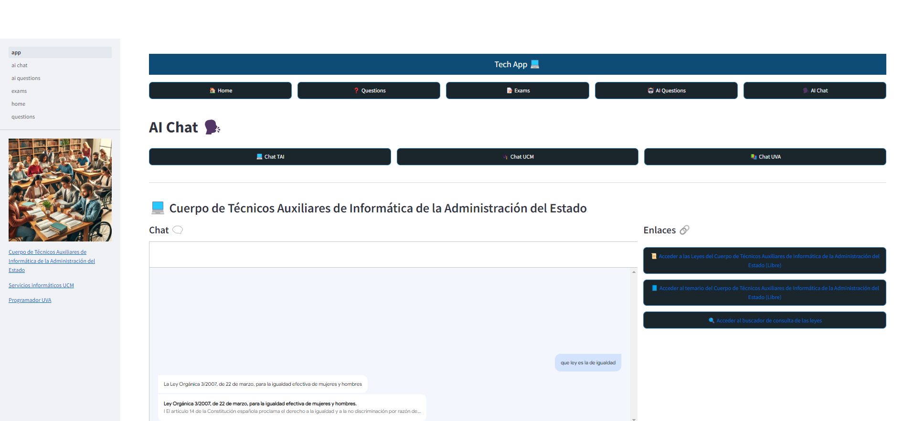
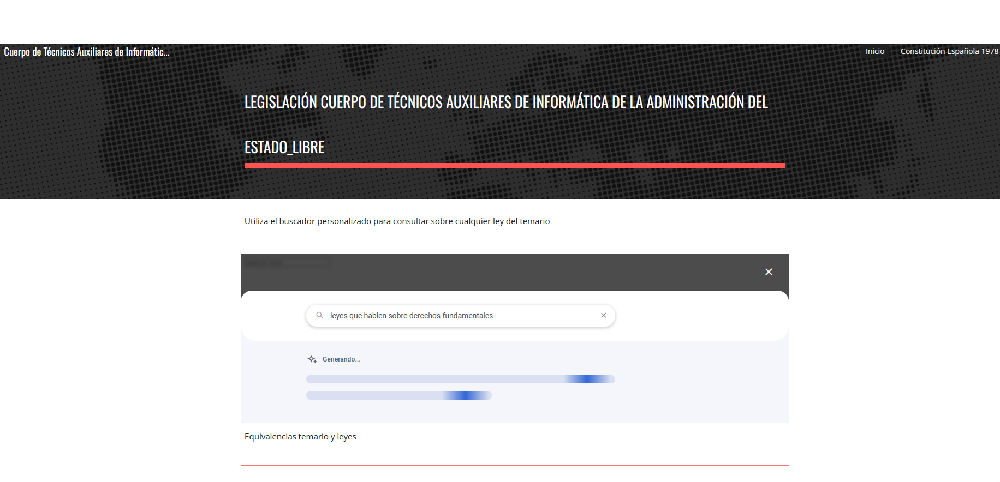

# Oposiciones Tech App




## Aplicación desplegada

Si quieres utilizar la aplicación puedes hacerlo en este enlace: [Oposiciones Tech App](https://oposiciones-streamlit-app-qrn7dlmeia-uk.a.run.app/).

## Descripción

Oposiciones Tech App es una aplicación diseñada para preparar oposiciones a programador/a utilizando IA Generativa. Nuestro objetivo es proporcionar una experiencia de estudio moderna y eficiente, aprovechando la última tecnología en inteligencia artificial para ayudarte a alcanzar tus metas.

Esta aplicación está comprometida con el respeto al medio ambiente, enfocándose en la reducción y reutilización del uso de IA. Creemos que es posible utilizar tecnología avanzada de manera sostenible y minimizar el impacto ecológico.

Para más información sobre el consumo de IA y su impacto ambiental, puedes visitar el siguiente enlace: [Consumo de IA y su Impacto Ambiental](https://earth.org/the-green-dilemma-can-ai-fulfil-its-potential-without-harming-the-environment/).

## Uso de la Aplicación 💡

- **Questions 📄**: Muestra preguntas de exámenes oficiales. 
  - Accede a questions.txt con preguntas oficiales de exámenes publicados. 
  - Lee el archivo y muestra las preguntas con las respuestas correctas.
  
      
  
- **Exams 📝**: Muestra preguntas de exámenes, tanto oficiales como generadas por IA de otros usuarios. Permite seleccionar por temáticas concretas.
  - Accede a una base de datos de BigQuery.
  - La base de datos tiene el siguiente esquema: question, answer_a, answer_b, answer_c, answer_d, correct_answer, theme, justification. 
  - En la base de datos, se incluyen las preguntas de exámenes oficiales y las preguntas generadas por IA en la pestaña "AI Questions" (Esta funcionalidad aún está en desarrollo).

    
  
    
  
- **AI Questions 🤖**: Genera preguntas nuevas con IA generativa.
  - Permite seleccionar la temática de las preguntas.
  - Utiliza un modelo ("gemini-1.0-pro") para generar las preguntas a partir de un prompt.

    
  
- **AI Chat 🗣️**: Accede a un chat sobre legislación y recursos disponibles.
  - Accede a un Agent Build con Gemini para preguntar sobre la legislación de las convocatorias.
  - Es posible acceder a recursos para descargar legislación y temarios.
  
       
  
## Buscar Legislación

La aplicación incluye una funcionalidad para buscar legislación relevante para las oposiciones.
Es un site google donde podemos acceder a un buscador de la legislación oficial para cada convocatoria.



## Instalación

Para instalar y ejecutar la aplicación localmente, sigue estos pasos:

1. Clona este repositorio.
   ```bash
   git clone https://github.com/tu-usuario/tu-repositorio.git

Envía un pull request con tus sugerencias y mejoras.

